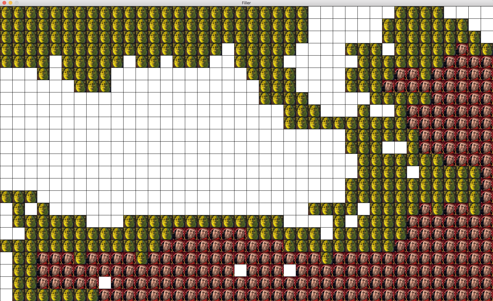
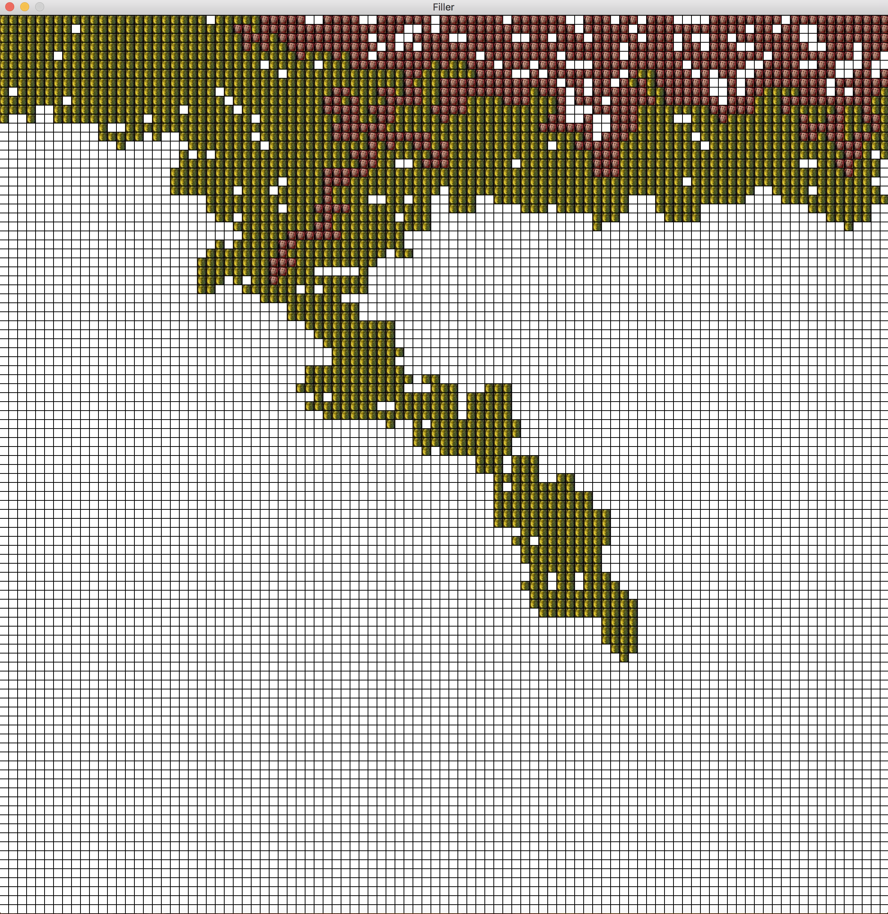

# 42 Project: Filler

This object of this program is to create an algorithm for a player that will compete against another player on a map. A VM will give random shaped pieces to each player and they must place them on the board without overlapping their own piece or the opponent. The player with the most pieces placed at the end wins.

A heat map was used to find the position closest to the opponent and place a piece there. Using this strategy the opponent will eventually be trapped and will not have anywhere to place their pieces.

## Getting Started

### Compiling

Run the following commands:

* To compile
	- `make`
* To remove objects:
	- `make clean`
* To remove objects and binary file (program):
	- `make fclean`
* To re-compile:
	- `make re`

### Executing

To execute the program:

`./filler_vm -f <map> -p1 <player> -p2 <player>`

*Maps are available in the fdf_examples directory*

#### Try it!

Try running the following:

`./filler_vm -f <map00> -p1 <kmckee.filler> -p2 <hcao.filler>`

`./filler_vm -f <map02> -p1 <carli.filler> -p2 <kmckee.filler>`

## Screenshots

**Program running:**

# Small:

# Medium:

# Large:

